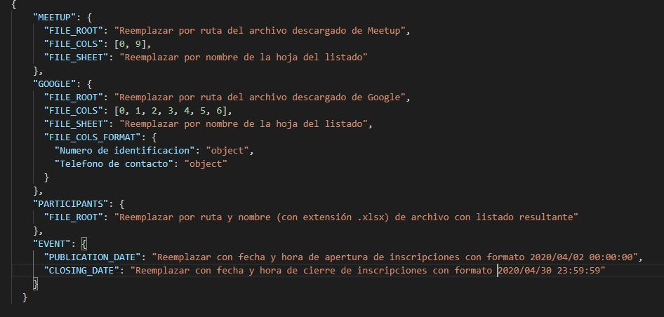

# SAR - Sistema Automático de Registro

Programa para la generación de listado de asistentes a Meetup solicitado por el sitio del evento a través de la información recolectada en meetup.com y el archivo de inscripción en Google Forms.

**Configuración inicial**

Para empezar, se deberán descargar los siguientes archivos en formato .xls o .xlsx:

1. Archivo de asistentes al evento Meetup que se descarga al entrar al evento en meetup.com, seleccionar la opción de administrar en Asistentes y luego la opción “Attendee details”.

Es importante aclarar que aunque el archivo se abra automáticamente con excel, no tiene el formato requerido por lo que es importante abrirlo y guardarlo con formato .xls o .xlsx

2. Archivo con respuestas de Google Forms para “Asistencia a Meetup en Koombea 2019” que se encontrará en la carpeta compartida de Drive del equipo de Python Barranquilla. Tener en cuenta que en columna “Dirección de correo electrónico”, se hace necesario quitar manualmente las tildes de la etiqueta del título (fila 0) para que el programa pueda ubicar esta columna por nombre correctamente.

Una vez descargados estos archivos, se deberá realizar la configuración de las siguientes propiedades en el archivo config.json:

**Comparación de información**

Para iniciar el proceso se deberá ejecutar por consola el archivo “file.py” y se procede a verificar la información de los asistentes teniendo que se encuentren coincidencias entre los inscritos en Meetup con los que hayan hecho su registro en Google, ya sea por nombre o correo eléctronico.

**Archivo de salida**

Al finalizar el proceso exitosamente, se generará en la ruta indicada el archivo con los campos requeridos para su presentación en sitio del evento que son: Dirección de correo electrónico, Nombre completo, Tipo de identificación, Número de identificación Teléfono de contacto, Profesión y/o Actividad.
